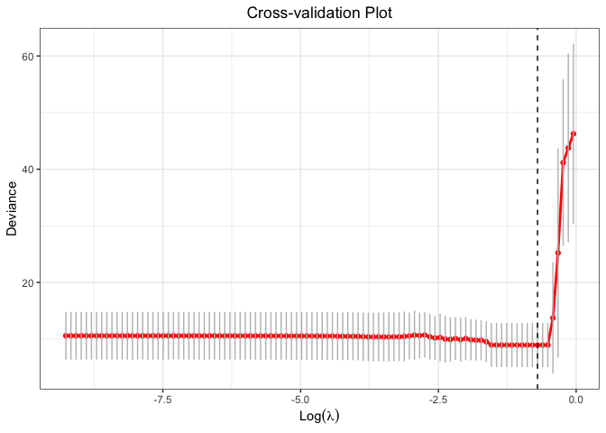
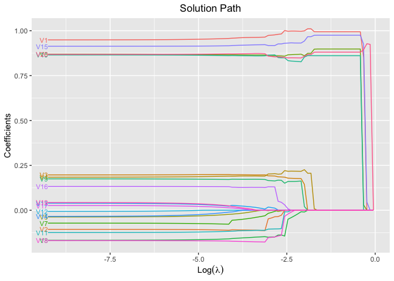
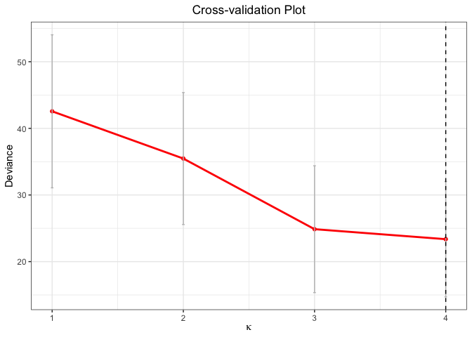
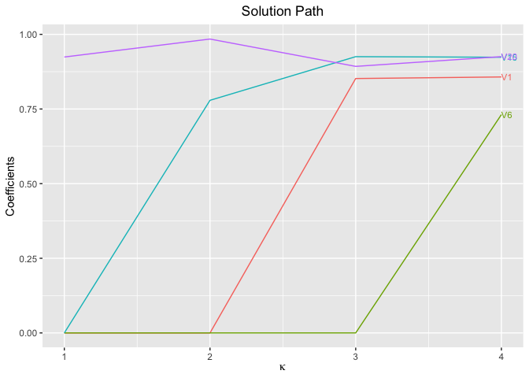
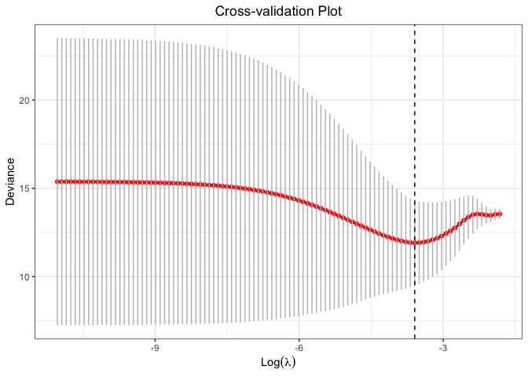
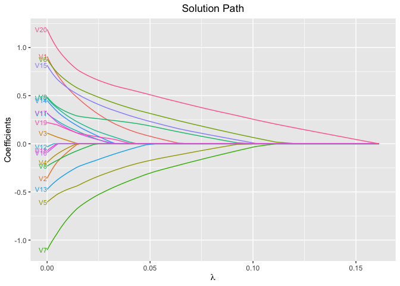

<!-- README.md is generated from README.Rmd. Please edit that file -->

# glmtlp

<!-- badges: start -->

<!-- badges: end -->

The goal of glmtlp is to fit generalized linear models with l0, l1 and
truncated lasso penalty with a fast procedure.

## Installation

You can install the released version of glmtlp from
[CRAN](https://CRAN.R-project.org) with:

``` r
install.packages("glmtlp")
```

## Examples

The following are three examples which show you how to use `glmtlp`:

``` r
library(glmtlp)
#> Loading required package: foreach
#> Loading required package: parallel
data("gau_data")
cv.fit <- cv.glmtlp(gau_data$X, gau_data$y, family = "gaussian", penalty = "tlp", ncores=2)
coef(cv.fit)
#>   intercept          V1          V2          V3          V4          V5 
#> -0.01462027  0.99417031  0.00000000  0.00000000  0.00000000  0.00000000 
#>          V6          V7          V8          V9         V10         V11 
#>  0.89829054  0.00000000  0.00000000  0.00000000  0.86093926  0.00000000 
#>         V12         V13         V14         V15         V16         V17 
#>  0.00000000  0.00000000  0.00000000  0.97496891  0.00000000  0.00000000 
#>         V18         V19         V20 
#>  0.00000000  0.00000000  0.88058520
plot(cv.fit)
```



``` r
fit <- glmtlp(gau_data$X, gau_data$y, family = "gaussian", penalty = "tlp")
coef(fit, lambda = cv.fit$lambda.min)
#>   intercept          V1          V2          V3          V4          V5 
#> -0.01462346  0.99416110  0.00000000  0.00000000  0.00000000  0.00000000 
#>          V6          V7          V8          V9         V10         V11 
#>  0.89828549  0.00000000  0.00000000  0.00000000  0.86094835  0.00000000 
#>         V12         V13         V14         V15         V16         V17 
#>  0.00000000  0.00000000  0.00000000  0.97498324  0.00000000  0.00000000 
#>         V18         V19         V20 
#>  0.00000000  0.00000000  0.88058869
predict(fit, X = gau_data$X[1:5, ], lambda = cv.fit$lambda.min)
#> [1] -2.0580246  0.6086993 -0.1049771 -0.8392137  2.3234783
plot(fit, xvar = "log_lambda", label = TRUE)
```



``` r
cv.fit <- cv.glmtlp(gau_data$X, gau_data$y, family = "gaussian", penalty = "l0", ncores=2)
coef(cv.fit)
#>   intercept          V1          V2          V3          V4          V5 
#> -0.08612557  0.85740421  0.00000000  0.00000000  0.00000000  0.00000000 
#>          V6          V7          V8          V9         V10         V11 
#>  0.73123303  0.00000000  0.00000000  0.00000000  0.00000000  0.00000000 
#>         V12         V13         V14         V15         V16         V17 
#>  0.00000000  0.00000000  0.00000000  0.92339627  0.00000000  0.00000000 
#>         V18         V19         V20 
#>  0.00000000  0.00000000  0.92557401
plot(cv.fit)
```



``` r
fit <- glmtlp(gau_data$X, gau_data$y, family = "gaussian", penalty = "l0")
coef(fit, kappa = cv.fit$kappa.min)
#>   intercept          V1          V2          V3          V4          V5 
#> -0.08612345  0.85744201  0.00000000  0.00000000  0.00000000  0.00000000 
#>          V6          V7          V8          V9         V10         V11 
#>  0.73126609  0.00000000  0.00000000  0.00000000  0.00000000  0.00000000 
#>         V12         V13         V14         V15         V16         V17 
#>  0.00000000  0.00000000  0.00000000  0.92340833  0.00000000  0.00000000 
#>         V18         V19         V20 
#>  0.00000000  0.00000000  0.92553304
predict(fit, X = gau_data$X[1:5, ], kappa = cv.fit$kappa.min)
#> [1] -1.27653238 -0.07749687 -0.96454326 -1.61842184  1.30294674
plot(fit, xvar = "kappa", label = TRUE)
```



``` r
data("bin_data")
cv.fit <- cv.glmtlp(bin_data$X, bin_data$y, family = "binomial", penalty = "l1", ncores=2)
coef(cv.fit)
#>   intercept          V1          V2          V3          V4          V5 
#> -0.13851097  0.27147279  0.00000000  0.00000000  0.00000000 -0.31545484 
#>          V6          V7          V8          V9         V10         V11 
#>  0.46258448 -0.49974658  0.00000000  0.25325831  0.10591942  0.02481680 
#>         V12         V13         V14         V15         V16         V17 
#>  0.00000000 -0.14310099  0.05090976  0.38578907  0.00000000  0.02754424 
#>         V18         V19         V20 
#>  0.00000000  0.06289112  0.63889293
plot(cv.fit)
```



``` r
fit <- glmtlp(bin_data$X, bin_data$y, family = "binomial", penalty = "l1")
coef(fit, lambda = cv.fit$lambda.min)
#>   intercept          V1          V2          V3          V4          V5 
#> -0.13851140  0.27148538  0.00000000  0.00000000  0.00000000 -0.31545724 
#>          V6          V7          V8          V9         V10         V11 
#>  0.46257686 -0.49974985  0.00000000  0.25324957  0.10592135  0.02481048 
#>         V12         V13         V14         V15         V16         V17 
#>  0.00000000 -0.14310223  0.05089196  0.38578606  0.00000000  0.02754008 
#>         V18         V19         V20 
#>  0.00000000  0.06289556  0.63889414
predict(fit, X = bin_data$X[1:5, ], type = "response", lambda = cv.fit$lambda.min)
#> [1] 0.4314030 0.3733417 0.3372594 0.3884085 0.4366392
plot(fit, xvar = "lambda", label = TRUE)
```



## References

<!-- MLA style -->

Shen, Xiaotong, Wei Pan, and Yunzhang Zhu. “Likelihood-based selection
and sharp parameter estimation.” *Journal of the American Statistical
Association* 107.497 (2012): 223-232.
<https://doi.org/10.1080/01621459.2011.645783>.

Tibshirani, Robert, et al. “Strong rules for discarding predictors in
lasso‐type problems.” *Journal of the Royal Statistical Society: Series
B (Statistical Methodology)* 74.2 (2012): 245-266.
<https://doi.org/10.1111/j.1467-9868.2011.01004.x>.

Yang, Yi, and Hui Zou. “A coordinate majorization descent algorithm for
l1 penalized learning.” *Journal of Statistical Computation and
Simulation* 84.1 (2014): 84-95.
<https://doi.org/10.1080/00949655.2012.695374>.
